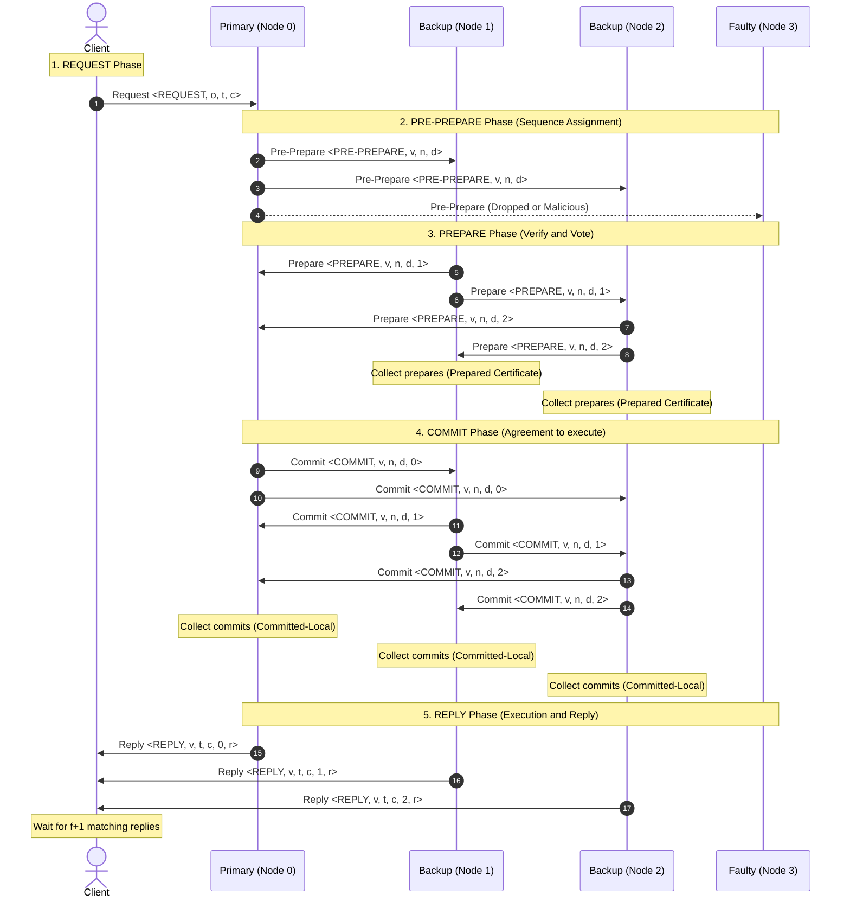
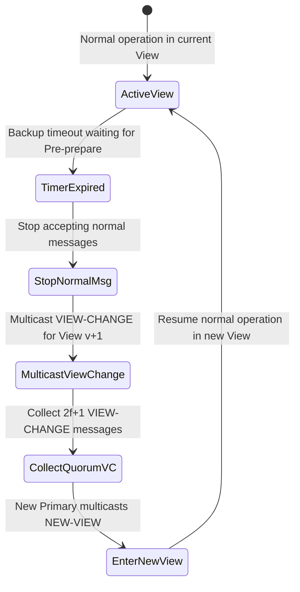

# ทำความเข้าใจ PBFT (Practical Byzantine Fault Tolerance) อย่างละเอียด

> **Scope:** general PBFT explainer. **No esp-pbft-specific decisions** (transport, crypto pattern, memory budget, etc.) are documented here — see the English docs for those.

เอกสารฉบับนี้อธิบายหลักการทำงาน โครงสร้าง และคีย์เวิร์ดสำคัญของโปรโตคอล **Practical Byzantine Fault Tolerance (PBFT)** ตามงานวิจัยระดับตำนานของ Miguel Castro และ Barbara Liskov (OSDI 1999) โดยมุ่งเน้นการแปลเป็นภาษาไทยที่เข้าใจง่าย อธิบายความเชื่อมโยงของแต่ละภาคส่วน และเน้นย้ำถึงกลไกการรับมือกับความล้มเหลวแบบไบแซนไทน์อย่างเป็นขั้นเป็นตอนและละเอียดครบถ้วนสมบูรณ์ (Lossless)

---

## 1. ที่มาและความสำคัญของ PBFT

ในระบบแบบกระจายศูนย์ (Distributed Systems) การบรรลุข้อตกลงร่วมกัน (Consensus) ระหว่างคอมพิวเตอร์หลายเครื่อง (Nodes) เป็นเรื่องยาก โดยเฉพาะอย่างยิ่งเมื่อโหนดบางส่วนอาจเกิดปัญหาขึ้น ความเสียหายในระบบแบ่งออกเป็นสองประเภทหลัก:
1. **Crash Faults (Fail-Stop):** โหนดหยุดทำงานไปดื้อๆ (เช่น ไฟดับ, เน็ตหลุด) ระบบที่ทนทานต่อปัญหานี้ เช่น Raft หรือ Paxos
2. **Byzantine Faults (Arbitrary Failures):** โหนดยังทำงานอยู่ แต่ส่งข้อมูลที่ผิดพลาด จงใจบิดเบือนข้อมูล ส่งข้อมูลให้แต่ละโหนดไม่เหมือนกัน หรือพยายามแฮกและควบคุมระบบ ซึ่ง PBFT ออกแบบมาเพื่อรับมือกับปัญหานี้โดยเฉพาะในระบบเครือข่ายอสมวาร (Asynchronous Network) เช่น อินเทอร์เน็ต

---

## 2. คีย์เวิร์ดสำคัญ (Core Keywords) และคำอธิบายการทำงาน

เพื่อให้เห็นภาพการทำงานของระบบอย่างชัดเจน นี่คือคำศัพท์สำคัญและบทบาทหน้าที่ของแต่ละตัวละครในระบบ PBFT:

| คีย์เวิร์ด (Keyword) | ชื่อภาษาไทย | คำอธิบายและความหมายเชิงปฏิบัติการ |
| :--- | :--- | :--- |
| **Replica** | โหนดจำลอง / โหนดระบบ | โหนดคอมพิวเตอร์ทั้งหมดที่เข้าร่วมในเครือข่าย PBFT เพื่อรันเครื่องสถานะ (State Machine) และเก็บข้อมูลชุดเดียวกัน โหนดเหล่านี้ต้องเป็นแบบ *Deterministic* (ถ้าป้อน Input เดิมในสภาวะเดิม จะต้องได้ Output เหมือนกันทุกเครื่อง) |
| **Primary (Leader)** | โหนดประธาน / ผู้นำ | โหนดที่มีหน้าที่หลักในการจัดคิวลำดับงาน (Sequence Number) ให้กับคำขอที่ได้รับจาก Client ในรอบการทำงาน (View) นั้นๆ โดยในแต่ละรอบจะมี Primary ได้เพียงโหนดเดียวเท่านั้น |
| **Backup (Follower)** | โหนดสำรอง / ผู้ตาม | โหนดจำลองอื่นๆ ในเครือข่ายที่ไม่ได้เป็น Primary ในรอบนั้น ทำหน้าที่ตรวจสอบความถูกต้องของการจัดลำดับงานของ Primary และโหวตข้อตกลงร่วมกัน |
| **Client** | ผู้ส่งคำขอ / โหนดผู้ใช้ | ลูกค้าภายนอกเครือข่ายที่ต้องการประมวลผลธุรกรรมหรือส่งคำสั่งเข้ามาในระบบ โดย Client จะส่งคำสั่งไปที่ Primary และรอคอยผลลัพธ์ตอบกลับจากเหล่า Replica |
| **View** | รอบการทำงาน / มุมมอง | ยุคสมัยของการทำงานภายใต้ประธาน (Primary) คนเดียวกัน มีหมายเลขระบุต่อเนื่องกัน (View 0, View 1, View 2, ...) โดยใช้สูตรหาตัวผู้นำคือ `Primary = View mod n` |
| **v (View Number)** | หมายเลขรอบการทำงาน | ตัวแปรที่ระบุค่าของ View ปัจจุบัน เพื่อให้โหนดจำลองใช้เช็กว่าข้อความส่งมาจากประธานในรอบปัจจุบันจริง ไม่ใช่ข้อความย้อนหลัง (Replay Attack) |
| **n (Sequence Number / Total Replicas)** | หมายเลขลำดับ / จำนวนโหนดรวม | ในโปรโตคอลทั่วไป n หมายถึง **หมายเลขคิวลำดับงานของธุรกรรม** (เช่น คำสั่งซื้อที่ n) แต่ในสมการระดับเครือข่าย (เช่น n = 3f + 1) n จะหมายถึง **จำนวนโหนดทั้งหมดในระบบ** |
| **d (Digest)** | ค่าแฮชของคำขอ | รหัสตัวแทนของข้อมูลธุรกรรมที่คำนวณผ่านฟังก์ชันแฮช (เช่น SHA-256) ช่วยลดปริมาณข้อมูลที่ต้องส่งผ่านเครือข่าย เพราะโหนดอื่นสามารถโหวตด้วย d แทนตัวธุรกรรมเต็มได้ |
| **Byzantine Fault (f)** | โหนดบกพร่องแบบไบแซนไทน์ | จำนวนโหนดเสียหรือโหนดโกงสูงสุดที่ระบบยอมรับให้เกิดขึ้นพร้อมๆ กันได้ โดยที่เครือข่ายยังประมวลผลได้ถูกต้อง ปลอดภัย และไม่ค้าง |
| **Quorum (2f + 1)** | เสียงข้างมากที่น่าเชื่อถือ | จำนวนคะแนนเสียงตอบกลับขั้นต่ำจากโหนดอื่นเพื่อให้แน่ใจว่าระบบตกลงใจก้าวไปยังขั้นตอนถัดไปได้อย่างปลอดภัย โดยในจำนวน 2f + 1 เสียงนี้ แม้จะมีโหนดโกหกปะปนอยู่ f ตัว แต่ก็ยังเหลือโหนดที่ดีอย่างน้อย f + 1 ตัวที่ร่วมเห็นชอบจริง |
| **Safety** | ความปลอดภัย / ความถูกต้องตรงกัน | คุณสมบัติที่รับประกันว่า โหนดดีทั้งหมดที่ไม่มีข้อบกพร่อง (Non-faulty) จะต้องตกลงใจสั่งรันธุรกรรมเดียวกันที่ลำดับคิวเดียวกันเสมอ (ไม่มีการแตกสาขาหรือเกิดการขัดแย้งของข้อมูล) |
| **Liveness** | ความต่อเนื่องของการทำงาน | คุณสมบัติที่รับประกันว่า ระบบจะต้องประมวลผลคำสั่งไปข้างหน้าได้เรื่อยๆ ไม่เกิดอาการค้างหรือหยุดนิ่ง (Deadlock) และ Client จะได้รับคำตอบตอบกลับเสมอ |
| **View-Change** | กระบวนการเปลี่ยนประธาน | ขั้นตอนการลงประชามติเพื่อปลดผู้นำ (Primary) คนปัจจุบันที่อาจค้าง ทำงานช้า หรือพยายามส่งข้อมูลโกหก เพื่อเลือกผู้นำคนใหม่ขึ้นมาแทน |
| **Stable Checkpoint** | จุดบันทึกสถานะที่มั่นคง | ขั้นตอนการเก็บกวาดข้อมูลเก่า (Garbage Collection) เพื่อล้างหน่วยความจำ (Log) เมื่อยืนยันว่ามีเสียงข้างมากทำงานผ่านจุดนั้นไปอย่างมั่นคงแล้ว |
| **Message Authentication Codes (MACs)** | รหัสรับรองความถูกต้องของข้อความ | วิธีการตรวจสอบยืนยันตัวตนของผู้ส่งข้อความอย่างรวดเร็วโดยใช้สมการคีย์สมมาตร ซึ่งมีประสิทธิภาพสูงกว่าลายเซ็นดิจิทัล (Digital Signature) มาก ช่วยให้ PBFT รันได้เร็วขึ้นเป็น 10 เท่าในการทำงานปกติ |

---

### 2.1 อธิบายเพิ่มเติมเกี่ยวกับความสัมพันธ์ของตัวแปร v, n, d

เพื่อป้องกันความสับสนของตัวแปรในขั้นตอน Consensus นี่คือรายละเอียดเพิ่มเติม:

#### 1) ความต่างระหว่าง v (View Number) และ n (Sequence Number)
เปรียบเทียบได้ง่ายๆ ผ่าน **ระบบการบริหารและประกาศนโยบาย**:
*   **v (View Number) เปรียบเหมือน "สมัยหรือเทอมของผู้นำ (ประธาน)"**
    *   ถ้า v = 1 หมายถึงช่วงเวลาที่ผู้นำคนที่ 1 บริหารระบบอยู่
    *   ค่า v จะคงที่เท่าเดิมไปเรื่อยๆ ตราบใดที่ผู้นำยังทำงานดีและไม่มีข้อบกพร่อง (ไม่มี View-Change)
    *   แต่เมื่อไหร่ที่โหนดผู้นำเริ่มค้างหรือโกง โหนดผู้ตามจะปลดและเริ่มสมัยใหม่โดยเพิ่มค่าเป็น v = 2 เพื่อเลือกผู้นำคนถัดไปขึ้นมาแทน
*   **n (Sequence Number) เปรียบเหมือน "เลขลำดับของกฎหมายหรือประกาศที่ออกในสมัยนั้น"**
    *   ในสมัยของประธานคนเดิม (v = 1) เขาจะประกาศงานรันคิวไปเรื่อยๆ เช่น งานลำดับที่ 1 (n = 1), ลำดับที่ 2 (n = 2), ลำดับที่ 3 (n = 3) เป็นต้น
    *   ค่า n จะเพิ่มขึ้น (+1) เสมอเมื่อมีธุรกรรมใหม่เข้ามาประมวลผล ในขณะที่ค่า v ยังเป็นค่าเดิม

#### 2) วิธีระบุผู้นำด้วยการหารเอาเศษ (Primary Selection)
ในแต่ละรอบ View ระบบจะแต่งตั้งโหนดใดโหนดหนึ่งขึ้นเป็นประธาน (Primary) โดยใช้สมการเศษส่วน (Modulo) กับจำนวนโหนดทั้งหมดที่มีในเครือข่าย (ในที่นี้คือ Replicas ทั้งหมด):

    Primary Node ID = v % จำนวนโหนดทั้งหมด

**ตัวอย่างเช่น:** หากเครือข่ายมีโหนดทั้งหมด **4 เครื่อง (คือ Node 0, Node 1, Node 2, Node 3)**
*   เมื่อระบบเริ่มต้นที่ **v = 0**: คำนวณ `0 % 4 = 0` -> **Node 0** เป็นประธาน
*   หากเกิดการปลดประธานและขยับเป็น **v = 1**: คำนวณ `1 % 4 = 1` -> **Node 1** เป็นประธานแทน
*   หากขยับรอบอีกครั้งเป็น **v = 2**: คำนวณ `2 % 4 = 2` -> **Node 2** เป็นประธาน
*   หากขยับรอบอีกครั้งเป็น **v = 3**: คำนวณ `3 % 4 = 3` -> **Node 3** เป็นประธาน
*   เมื่อประธานคนสุดท้ายมีปัญหาและขยับเป็น **v = 4**: คำนวณ `4 % 4 = 0` -> วนกลับมาให้ **Node 0** เป็นประธานอีกครั้ง (เมื่อออนไลน์ปกติ)

วิธีนี้ทำให้ทุกโหนดรู้ผู้มีอำนาจสั่งการใน View นั้นๆ ได้ทันทีโดยไม่ต้องเสียเวลาตกลงหาผู้นำใหม่ผ่านเครือข่าย

---

## 3. แผนผังความเชื่อมโยงขั้นตอนปกติ (Normal-Case Operation Flow)

ในสถานการณ์ปกติที่ประธาน (Primary) ทำงานได้อย่างถูกต้องและซื่อสัตย์ โปรโตคอล PBFT จะประมวลผลผ่านกระบวนการยืนยันแบบ **3 ขั้นตอน (3-Phase Consensus)** เพื่อให้โหนดมั่นใจว่าลำดับธุรกรรมปลอดภัยก่อนที่จะบันทึกลงระบบจริง ดังแผนภาพนี้:

---

## 4. รายละเอียดเจาะลึกการทำงานของแต่ละเฟส

### 4.1 เฟส 1: Request (ผู้ใช้ส่งคำขอ)
*   **การเชื่อมโยง:** เป็นจุดเริ่มต้นการทำธุรกรรม
*   **การทำงาน:** `Client` ส่งข้อความร้องขอการรันเครื่องสถานะไปยัง `Primary` พร้อมประทับตราเวลา (`t`) เพื่อป้องกันการส่งซ้ำ (Replay Attack)

### 4.2 เฟส 2: Pre-Prepare (กำหนด Sequence และกระจายงาน)
*   **การเชื่อมโยง:** เชื่อมโยงตัวธุรกรรมเข้ากับลำดับคิว (Sequence Number)
*   **การทำงาน:** `Primary` กำหนดลำดับงาน n ประทับตราด้วยหมายเลขรอบ v และคำนวณ Hash Digest d ของธุรกรรม จากนั้นส่งข้อความ `<PRE-PREPARE, v, n, d>` ไปยัง `Backup` ทุกโหนด เพื่อเป็นการประกาศว่า "ฉันขอนำเสนอให้ธุรกรรมนี้รันที่ลำดับที่ n ในรอบนี้นะ"

### 4.3 เฟส 3: Prepare (การโหวตยืนยันลำดับคำสั่ง)
*   **การเชื่อมโยง:** ป้องกันการป้อนข้อมูลขัดแย้งของ Primary (เช่น Primary แอบส่งลำดับสลับกันให้โหนดอื่น)
*   **การทำงาน:**
    1. เมื่อ `Backup` แต่ละโหนดได้รับ Pre-Prepare จะตรวจสอบความถูกต้อง เช่น ลายเซ็นตรงไหม, อยู่ใน View ปัจจุบันรึเปล่า, และไม่มีข้อมูลขัดแย้งกันก่อนหน้า
    2. หากผ่านเกณฑ์ โหนดนั้นจะส่งข้อความ `<PREPARE, v, n, d, i>` ไปหาโหนดจำลองทุกตัวในระบบ (Multicast) เพื่อยืนยันว่า "ฉันเห็นพ้องว่าธุรกรรมนี้ควรอยู่ในลำดับที่ n"
    3. เมื่อมีโหนดสะสมข้อความ Prepare ที่เหมือนกันจากโหนดต่างๆ ครบ 2f โหนด (บวกตัวเองรวมเป็น 2f + 1) ระบบจะเรียกว่าเกิดสถานะ **Prepared** (โหนดนั้นได้บันทึกใบรับรองความพร้อมจัดลำดับงานลงใน Log ของตนเองแล้ว)

### 4.4 เฟส 4: Commit (การยืนยันข้อตกลงและตกลงใจเขียนลงระบบ)
*   **การเชื่อมโยง:** ทำให้โหนดมั่นใจว่าโหนดดีข้างมากได้จัดทำ Prepared Certificate เสร็จสิ้นและตกลงในลำดับคำสั่งเดียวกันเรียบร้อยแล้ว แม้ในอนาคตจะเกิดการเปลี่ยนตัวประธาน (View-Change) ลำดับนี้ก็จะไม่สูญหายหรือสลับที่
*   **การทำงาน:**
    1. หลังจากโหนดถึงสถานะ Prepared จะต้องส่งข้อความ `<COMMIT, v, n, d, i>` ไปหาโหนดจำลองทุกโหนด
    2. โหนดแต่ละโหนดจะรอเก็บรวบรวมข้อความ Commit จากโหนดอื่นๆ ที่ตรงกันจำนวน 2f + 1 ข้อความ (รวมตัวเอง)
    3. เมื่อได้ครบแล้ว จะเกิดสถานะที่เรียกว่า **Committed-Local** แปลว่า "โหนดดีส่วนใหญ่ต่างสัญญากันแล้วว่าจะรันคำสั่งนี้ที่ลำดับที่ n อย่างไม่มีวันแปรเปลี่ยน"

### 4.5 เฟส 5: Reply (ส่งผลตอบสนองกลับ Client)
*   **การเชื่อมโยง:** ตรวจสอบผลลัพธ์ขั้นสุดท้ายของ Client
*   **การทำงาน:**
    1. หลังจากโหนดจำลองถึงสถานะ Committed-Local และประมวลผลคำสั่งก่อนหน้า (ลำดับ 1 ถึง n-1) เรียบร้อยแล้ว โหนดจะรันคำสั่งที่ลำดับ n ลงในระบบจริง
    2. ส่งข้อความตอบกลับ `<REPLY, v, t, c, i, r>` ไปยัง `Client` โดยตรง (r คือผลลัพธ์ของการรันคำสั่ง)
    3. ฝั่ง `Client` จะเฝ้ารอจนได้ข้อความตอบกลับที่ระบุผลลัพธ์เหมือนกันทุกประการจำนวนอย่างน้อย f + 1 ข้อความจาก Replica ต่างเครื่อง จึงจะเชื่อถือได้ว่าคำสั่งรันสำเร็จอย่างสมบูรณ์ไร้ข้อกังขา

---

## 5. ทำไมต้องเป็นสูตร n = 3f + 1?

เหตุใดเราจึงต้องใช้เครื่องคอมพิวเตอร์อย่างน้อย 4 เครื่อง (n = 4) ในการรองรับโหนดโกง 1 เครื่อง (f = 1) ?

ลองจินตนาการว่าระบบมีโหนดทั้งหมด n โหนด และมีโหนดไม่ดีปะปนอยู่ f โหนด:
1. เพื่อรักษาระบบให้รันต่อได้ (Liveness) แม้โหนดไม่ดี f ตัวจะไม่ตอบสนองเลย เราก็ยังต้องรอคำตอบจากโหนดที่เหลือเพียง n - f โหนด
2. แต่ในกลุ่ม n - f โหนดที่ส่งคำตอบมาให้เรานั้น อาจมีโหนดโกงปะปนอยู่ถึง f โหนดที่เป็นฝ่ายแกล้งส่งข้อมูลเท็จเข้ามา ดังนั้น โหนดดีที่เหลือจริงๆ จะมีเพียง (n - f) - f = n - 2f โหนด
3. เพื่อให้มั่นใจได้ว่าระบบสามารถหาข้อยุติที่เป็นความเห็นจากเสียงข้างมากของโหนดดีจริงๆ จำนวนโหนดดีจะต้องมากกว่าโหนดโกงเสมอ นั่นคือ:

   n - 2f > f

   n > 3f

   ดังนั้น จำนวนโหนดขั้นต่ำที่สุดที่จะสามารถรับประกันความปลอดภัยภายใต้ภัยคุกคามแบบไบแซนไทน์ได้คือ n = 3f + 1 โหนดนั่นเอง

---

## 6. กลไกการเปลี่ยนผู้นำ (View-Change) เมื่อเกิดปัญหา

หากโหนดประธาน (Primary) เริ่มทำตัวผิดแปลกไป เช่น จงใจเงียบหายไปเพื่อทำลายระบบ (Denial-of-Service) หรือไม่ส่งธุรกรรมต่อในเวลาที่ควร จะมีขั้นตอนดังนี้เพื่อกู้คืนระบบ:

1. **การหมดเวลา (Timer Timeout):** โหนด Backup ทุกตัวจะมีตัวจับเวลา (Timer) ทันทีที่ส่งคำร้องขอไปหา Primary แต่ไม่ได้รับการประมวลผลกลับมาตามเวลาที่กำหนด
2. **การโหวตปลด (VIEW-CHANGE):** Backup จะเปลี่ยนสถานะ หยุดรับส่งข้อความธรรมดาชั่วคราว และทำการ Multicast ข้อความ `<VIEW-CHANGE, v+1, n, C, P, i>` เพื่อเสนอให้ข้ามไปทำงานใน View ใหม่ (v+1) พร้อมแนบหลักฐาน (Prepared Certificate เดิมที่ยังค้างอยู่) เพื่อให้มั่นใจว่าจะไม่มีการสูญเสียข้อมูลธุรกรรมที่ตกลงกันไปแล้ว
3. **การเข้าสู่ประธานคนใหม่ (NEW-VIEW):** เมื่อ Primary คนใหม่ของ View ถัดไป ได้รับข้อความโหวต VIEW-CHANGE จากโหนดต่างๆ ครบจำนวน 2f + 1 ข้อความ มันจะทำการประมวลผลรวบรวมหลักฐานและกระจายส่งข้อความ `<NEW-VIEW, v+1, V, O>` เพื่อให้ทุกโหนดสอดประสานงานและกลับมาทำงานต่อได้ทันที
4. **การรักษาความต่อเนื่องของการกู้ภัย (Liveness & Backoff):** เพื่อหลีกเลี่ยงไม่ให้โหนดค้างหรือติดอยู่ในลูปโหวตสลับผู้นำไปเรื่อยๆ จนระบบรันต่อไม่ได้ ทุกครั้งที่ข้ามรอบไป View ใหม่แล้วล้มเหลว (เพราะหาประธานใหม่ยังไม่ได้หรือหมดเวลาอีกรอบ) ตัวจับเวลาจับเวลา (Timeout duration) จะขยายตัวเป็นสองเท่าแบบทวีคูณ (Exponential Backoff) เช่น จาก 2 วินาที เป็น 4 วินาที, 8 วินาที เพื่อให้โหนดดีมีเวลาเพียงพอในการส่งข้อความตรวจสอบและปรับสถานะให้ตรงกัน

---

## 7. จุดบันทึกสถานะและการเก็บกวาดหน่วยความจำ (Garbage Collection)

ในการประมวลผลจริง หากปล่อยให้ Log เก็บข้อมูลธุรกรรมไปเรื่อยๆ หน่วยความจำของอุปกรณ์จะเต็มอย่างรวดเร็ว (โดยเฉพาะอุปกรณ์ขนาดเล็กเช่นไมโครคอนโทรลเลอร์) PBFT จึงมีกลไกควบคุมการใช้หน่วยความจำและขอบเขตของข้อมูลอย่างละเอียด ดังนี้:

### 7.1 กลไกจุดบันทึกสถานะ (Stable Checkpoint)
*   **ความหมาย:** Checkpoint คือภาพบันทึกสถานะ (State Snapshot) ของระบบ ณ ลำดับธุรกรรมใดธุรกรรมหนึ่ง ส่วน Stable Checkpoint คือสถานะที่ได้รับการรับประกันและเซ็นยืนยันจากโหนดดีเสียงข้างมากแล้วว่าถูกต้องและปลอดภัย
*   **ขั้นตอนการเกิด Stable Checkpoint:**
    1.  ทุกๆ ช่วงเวลาหนึ่ง (เช่น ทุกๆ 100 ลำดับคำสั่งประมวลผลเสร็จสิ้น เช่น ที่ลำดับ n = 100, 200, 300) โหนดแต่ละเครื่องจะทำ Snapshot และคำนวณค่าแฮชของสถานะในเครื่องตนเอง
    2.  โหนดแต่ละโหนดจะส่งข้อความ `<CHECKPOINT, n, d, i>` แบบกระจายกลุ่ม (Multicast) หาโหนดอื่น โดยที่ n คือลำดับธุรกรรมล่าสุดที่รันเสร็จ, d คือแฮชของสถานะนั้น, และ i คือหมายเลขโหนดของตน
    3.  โหนดจำลองจะรอเก็บรวบรวมข้อความ Checkpoint ที่ระบุลำดับ n เดียวกันและมีแฮช d เหมือนกันทุกประการจากโหนดอื่นๆ ครบคณะ Quorum จำนวน 2f + 1 ข้อความ (รวมตัวเอง)
    4.  เมื่อเก็บรวบรวมหลักฐานครบแล้ว จุดนี้จะเรียกว่า **Stable Checkpoint** ทันที โหนดจะล้างประวัติธุรกรรม (Log Entries) และข้อความโปรโตคอล (Pre-Prepare, Prepare, Commit) ที่มีหมายเลขลำดับต่ำกว่าหรือเท่ากับ n ออกจากหน่วยความจำอย่างถาวร เพราะมั่นใจได้แล้วว่าระบบดีส่วนใหญ่ได้ก้าวผ่านจุดนี้และยอมรับมันแล้ว

### 7.2 กลไกการควบคุมขอบเขตหมายเลขลำดับ (Watermarks)
เพื่อป้องกันไม่ให้โหนดประธานที่โกง (Faulty Primary) พยายามทำลายระบบโดยเจตนาส่งคิวหมายเลขธุรกรรมที่ใหญ่มากจนข้ามช่วงระบบเพื่อทำลาย Log (เช่น แกล้งกำหนดหมายเลขลำดับ n = 999,999,999 ทำให้โหนดอื่นรวนจากการรอคอยคิวที่ขาดหายไป) PBFT จึงใช้กลไกที่เรียกว่า **กรอบกรองคิวข้อมูล (Watermarks)**:
*   **Low-Water Mark (h):** ขีดจำกัดคิวล่างสุด ซึ่งมีค่าเท่ากับหมายเลขลำดับธุรกรรมของ Stable Checkpoint ล่าสุด
*   **High-Water Mark (H):** ขีดจำกัดคิวบนสุด คำนวณจากสูตร: `H = h + k` โดยที่ k คือค่าคงที่ขนาดหน้าต่าง (Window Size) เช่น k = 100 หรือ 200
*   **เกณฑ์การตรวจสอบข้อความ:** โหนดจำลองที่ดีทั้งหมดจะปัดตก (Reject) ข้อความใดๆ ก็ตาม (ไม่ว่าจะเป็น Pre-Prepare, Prepare หรือ Commit) ที่ระบุหมายเลขคิว n หากค่า n นั้นไม่อยู่ในกรอบขอบเขตนี้:
    
    h < n <= H
    
    หากส่งคำขอต่ำกว่า h หรือมากกว่า H ข้อความเหล่านั้นจะถูกมองว่าไม่ถูกต้องและไม่ได้รับการประมวลผลเด็ดขาด
*   **การเลื่อนหน้าต่าง (Sliding Window):** เมื่อเกิด Stable Checkpoint ใหม่ที่ลำดับ n ค่า h จะเลื่อนขยับขึ้นมาเท่ากับ n ทันที และค่า H จะเลื่อนตามขึ้นไปเป็น n + k ทำให้กรอบรับข้อมูลเลื่อนตามระบบที่พัฒนาไปเรื่อยๆ

---

## 8. การทำงานระดับปฏิบัติการเชิงลึก (Key Optimizations)

เอกสารงานวิจัยของ Castro & Liskov ได้ออกแบบกลไกพิเศษหลายประการเพื่อขจัดจุดบกพร่องด้านประสิทธิภาพ และทำให้ระบบ Consensus ทนทานความเสียหายระดับไบแซนไทน์ประมวลผลได้เร็วเสมือนระบบรวมศูนย์ทั่วไป:

### 8.1 การยืนยันสิทธิ์ความเร็วสูงด้วยเวกเตอร์ MAC (Authenticators)
เนื่องจากลายเซ็นดิจิทัลแบบกุญแจสาธารณะ (เช่น RSA) มีการคำนวณที่ล่าช้าและสิ้นเปลืองพลังงาน CPU สูงมากในยุคแรก PBFT จึงเปลี่ยนมาใช้ Symmetric cryptography ในการยืนยันข้อความปกติ:
*   **ปัญหาของ MAC (Message Authentication Code):** แม้การคำนวณ MAC จะเร็วมาก แต่เป็นโปรโตคอลการคุยแบบตัวต่อตัว (Point-to-Point) หมายความว่า โหนดที่ 3 จะไม่สามารถพิสูจน์ความถูกต้องของข้อความที่โหนดที่ 1 ส่งให้โหนดที่ 2 ได้
*   **แนวทางการแก้ปัญหา (Authenticators):** 
    *   PBFT แก้ไขปัญหานี้โดยการให้โหนดแชร์คีย์ลับสมมาตรร่วมกันแบบแยกคู่ (โหนด i จะมีคีย์ลับร่วมกับโหนดอื่นๆ ทุกโหนดแยกจากกัน)
    *   เมื่อโหนดต้องการส่งข้อความแบบกระจายกลุ่ม (Multicast) แทนที่จะเซ็นลายเซ็นดิจิทัลเดียว มันจะสร้าง **เวกเตอร์ของ MAC (เรียกว่า Authenticator)** ซึ่งข้างในประกอบด้วยข้อมูล MAC ของข้อความนั้นแยกตามคีย์ลับของแต่ละโหนดปลายทาง
    *   ผู้รับข้อความแต่ละโหนดจะตรวจสอบความถูกต้องเฉพาะค่า MAC ในตำแหน่งของตนเอง เสมือนได้รับลายเซ็นที่ทำขึ้นมาเพื่อตัวเองโดยเฉพาะ
    *   กระบวนการนี้ทำให้การยืนยันตัวตนในเครือข่ายรวดเร็วกว่าระบบเดิมถึง 1,000 เท่าในช่วงเวลาการทำงานปกติ (Normal-case) และจะเปลี่ยนไปใช้ลายเซ็นดิจิทัล (Digital Signatures) เฉพาะช่วงกู้ภัยระบบ (View-Change) เท่านั้น

### 8.2 การคำนวณค่าแฮชสถานะแบบสะสมเพิ่ม (Incremental Cryptography)
ในตอนทำ Checkpoint ระบบไม่จำเป็นต้องดึงหน่วยความจำทั้งหมดมารัน Hash ฟังก์ชันใหม่ตั้งแต่ต้นเพื่อหาค่าแฮช d ของ Snapshot:
*   **วิธีการทำงาน:** ระบบแบ่งเมมโมรี่ออกเป็นบล็อกขนาดเล็ก (เช่น บล็อกละ 512 ไบต์) เมื่อเกิดการอัปเดตข้อมูลขึ้นที่บล็อกใดบล็อกหนึ่ง ระบบจะนำค่าแฮชของบล็อกเก่าจุดนั้นมาคำนวณหักลบออก แล้วบวกค่าแฮชบล็อกใหม่ที่เพิ่งเขียนทับเข้าไปร่วมกับแฮชสถานะเดิม (คำนวณแบบ Modulo กับเลขจำนวนเต็มขนาดใหญ่มาก) 
*   ผลลัพธ์ทำให้เกิดค่าแฮชใหม่ที่มีความปลอดภัยสูงโดยไม่ต้องเสียเวลารันฟังก์ชันแฮชกับเมมโมรี่ขนาดหลายกิกะไบต์ทั้งหมด ช่วยเพิ่มประสิทธิภาพระบบได้มหาศาล

### 8.3 การสำเนาข้อมูลเมื่อเกิดการเขียน (Copy-on-Write)
เพื่อไม่ให้ระบบสะดุดระหว่างที่โหนดกำลังคำนวณและตรวจสอบข้อมูล Checkpoint:
*   **วิธีการทำงาน:** โหนดจำลองจะรักษาสำเนาสถานะไว้ 3 ระดับ ได้แก่ สถานะของ Stable Checkpoint ล่าสุด, สถานะของ Checkpoint ที่รอการตรวจสอบ (Unstable Checkpoint), และสถานะการประมวลผลปัจจุบัน (Current State)
*   **การประหยัดพื้นที่:** แทนที่จะก๊อปปี้ข้อมูลแยกร่างจริงๆ ระบบจะเปิดใช้งานฟังก์ชัน **Copy-on-Write (CoW)** บล็อกข้อมูลปัจจุบันจะชี้ไปยังตำแหน่งหน่วยความจำเดิม หากระบบปัจจุบันจำเป็นต้องเขียนทับบล็อกนั้น ระบบปฏิบัติการจะก๊อปปี้บล็อกข้อมูลตัวเดิมออกมาไว้ที่อื่นก่อน (เพื่อรักษาข้อมูล ณ จุด Checkpoint ไว้สำหรับคำนวณแฮช) จากนั้นจึงเขียนทับข้อมูลใหม่ลงไป ช่วยประหยัดเนื้อที่และเวลาประมวลผลได้อย่างมาก

### 8.4 การทำงานล่วงหน้าชั่วคราว (Tentative Execution) และธุรกรรมอ่านอย่างเดียว (Read-only)
*   **Tentative Execution:** โหนดจำลองสามารถรันคำสั่งและตอบกลับ Client ได้ทันทีตั้งแต่ได้รับเสียงโหวตครบคณะ Prepare (Prepared State) โดยไม่ต้องรอให้จบคบขั้นตอน Commit (Commit Phase) ช่วยลด latency ลงไป 1 รอบเต็มๆ อย่างไรก็ตาม หากเกิดปัญหา View-Change ขึ้นระหว่างนั้น โหนดจะสามารถยกเลิกและย้อนกลับ (Rollback) ไปยัง Stable Checkpoint ล่าสุดได้
*   **Read-only Optimization:** หาก Client ส่งคำขอเพื่อขอ "อ่านข้อมูลอย่างเดียว" (เช่น เรียกดูยอดเงิน) โหนดสามารถตอบกลับผลลัพธ์ได้ทันทีโดยไม่ต้องผ่านกระบวนการ Consensus 3 เฟสเลย ช่วยลดการส่งข้อความระหว่างกันของโหนดสำรองไปได้อย่างสมบูรณ์แบบ

---

## สรุปภาพรวมความเชื่อมโยง

ความงดงามของ PBFT คือการสร้างระเบียบท่ามกลางความปั่นป่วน (Byzantine environment) ผ่านกลไกประสานสองมิติ:
*   **แนวระนาบ (Consensus Phases):** การประสานงานกันระหว่าง **Client -> Primary -> Backups -> Client** เพื่อตกลงลำดับการประมวลผลร่วมกัน
*   **แนวตั้ง (View-Change & Garbage Collection):** ระบบการปรับตัวเมื่อผู้ควบคุมกฎบิดพริ้ว และระบบควบคุมการใช้หน่วยความจำให้กะทัดรัดเพื่อความยั่งยืนของการทำงานระยะยาว

ทั้งหมดนี้ทำให้โปรโตคอล PBFT เป็นรากฐานสำคัญในระบบบล็อกเชน (Blockchain) ในระบบการเงิน และระบบจำลองแบบทนทานความเสียหาย (State Machine Replication) ในปัจจุบัน
